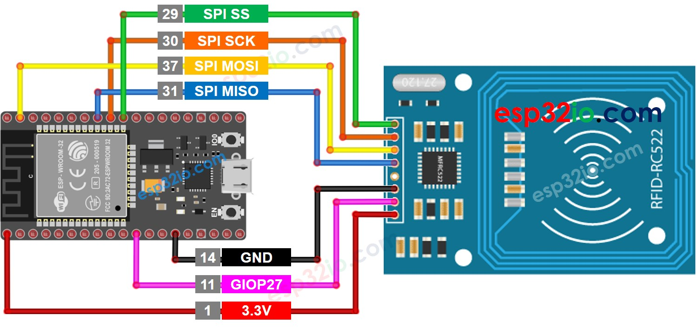
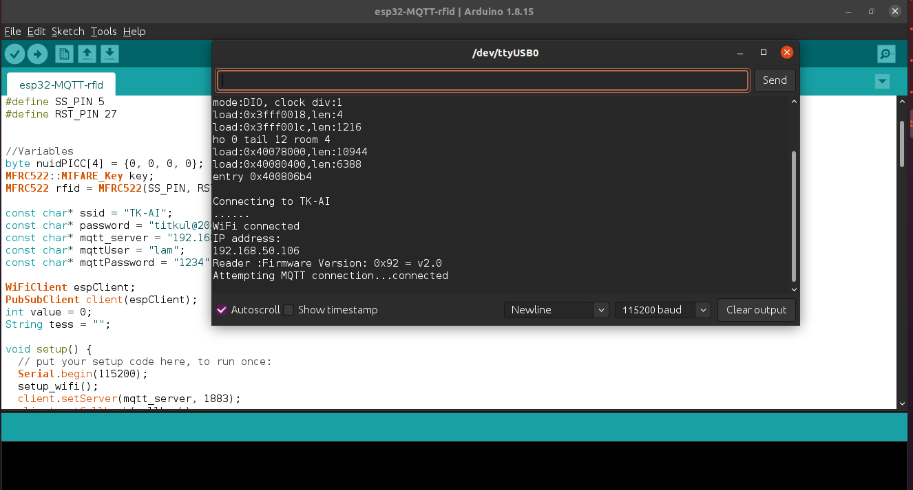
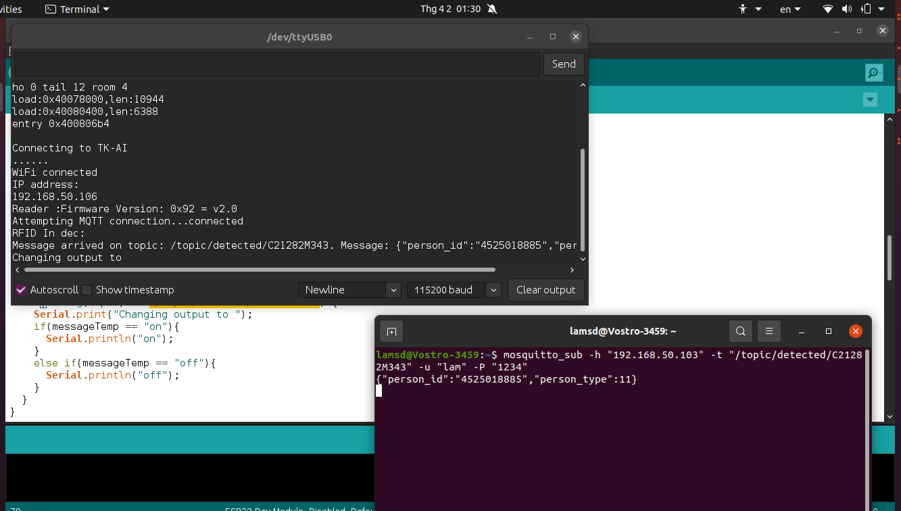

# Show UID of RFID.

## Prepare:
1 - ESP32 board.

2 - FRID-RC522.

3 - NFC scard.

## Processing for system.
1. Diagram.



2. Code.
- Decalce the pin on ESP32.
```c
#define SS_PIN 5
#define RST_PIN 27
```
- Setting config of the system.
```c
const char* ssid = "TK-AI";
const char* password = "*****";
const char* mqtt_server = "*****";
const char* mqttUser = "***";
const char* mqttPassword = "***";
```
- Change topic of MQTT:
```c
if (String(topic) == "/topic/detected/C21282M343") {
    Serial.print("Changing output to ");
    if(messageTemp == "on"){
      Serial.println("on");
    }
    else if(messageTemp == "off"){
      Serial.println("off");
    }
  }
```
- RFID Function used to  for reading RFID.
```c
void readRFID(void ) { /* function readRFID */
 ////Read RFID card
 for (byte i = 0; i < 6; i++) {
   key.keyByte[i] = 0xFF;
 }
 // Look for new 1 cards
 if ( ! rfid.PICC_IsNewCardPresent())
   return ;
 // Verify if the NUID has been readed
 if (  !rfid.PICC_ReadCardSerial())
   return ;
 // Store NUID into nuidPICC array
 for (byte i = 0; i < 4; i++) {
   nuidPICC[i] = rfid.uid.uidByte[i];
 }
 Serial.print(F("RFID In dec: "));
 
// client.publish("esp32/output", rfid.uid.uidByte);
 client.publish("/topic/detected/C21282M343",printDec(rfid.uid.uidByte, rfid.uid.size).c_str());
 Serial.println();
 rfid.PICC_HaltA();
}
```    
- Covert Hex to Dec, using for simply.
```c
String printDec(byte *buffer, byte bufferSize) {
 String st = "";
 String datase = "";
 for (byte i = 0; i < bufferSize; i++) {
   st +=  buffer[i];
 }
 datase += "{\"person_id\":\""+ st +"\",\"person_type\":11}";
  return datase;
}

```
3. Result.
- Successfull connect with broker.



- Result: Terminal ubuntu and Console on arduino.

## Reference: 
1. https://esp32io.com/tutorials/esp32-rfid-nfc
